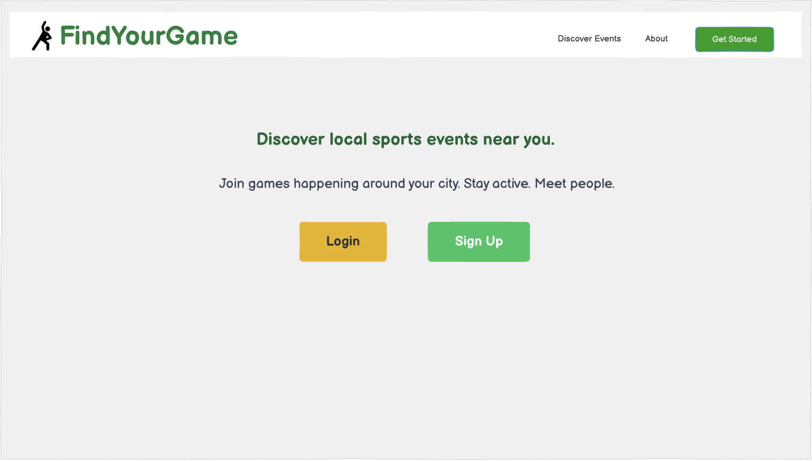
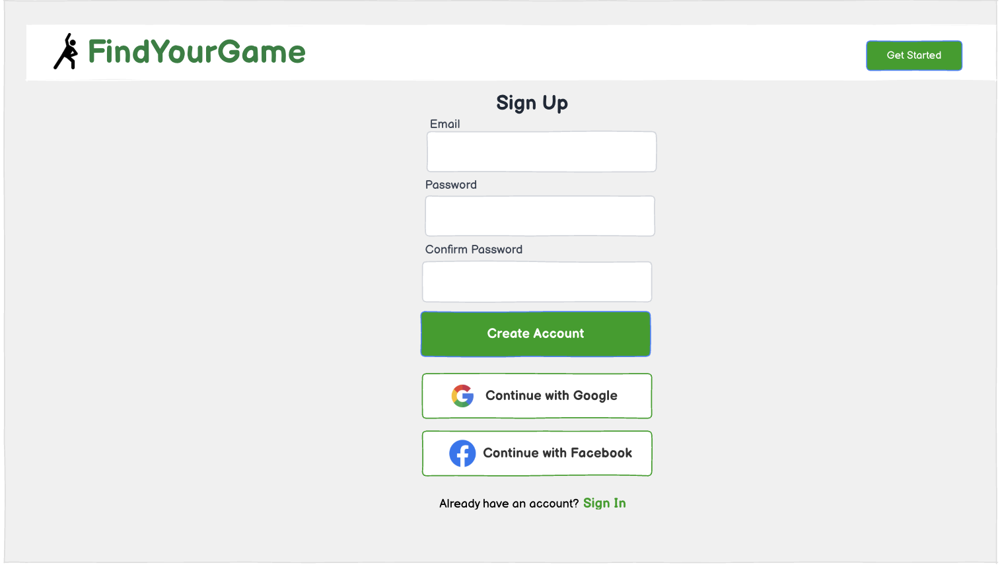
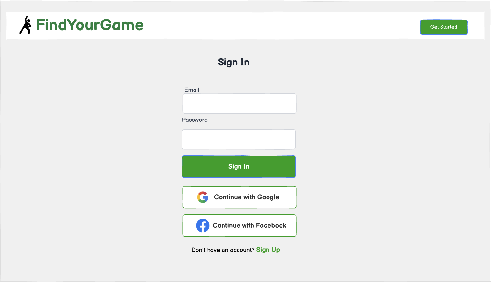
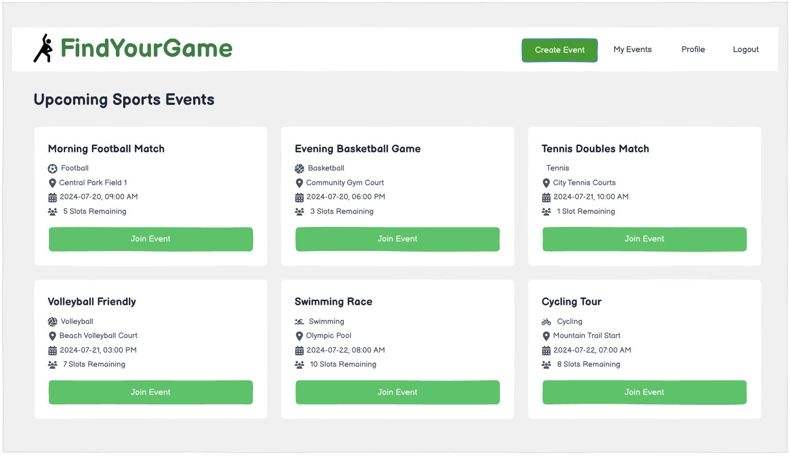
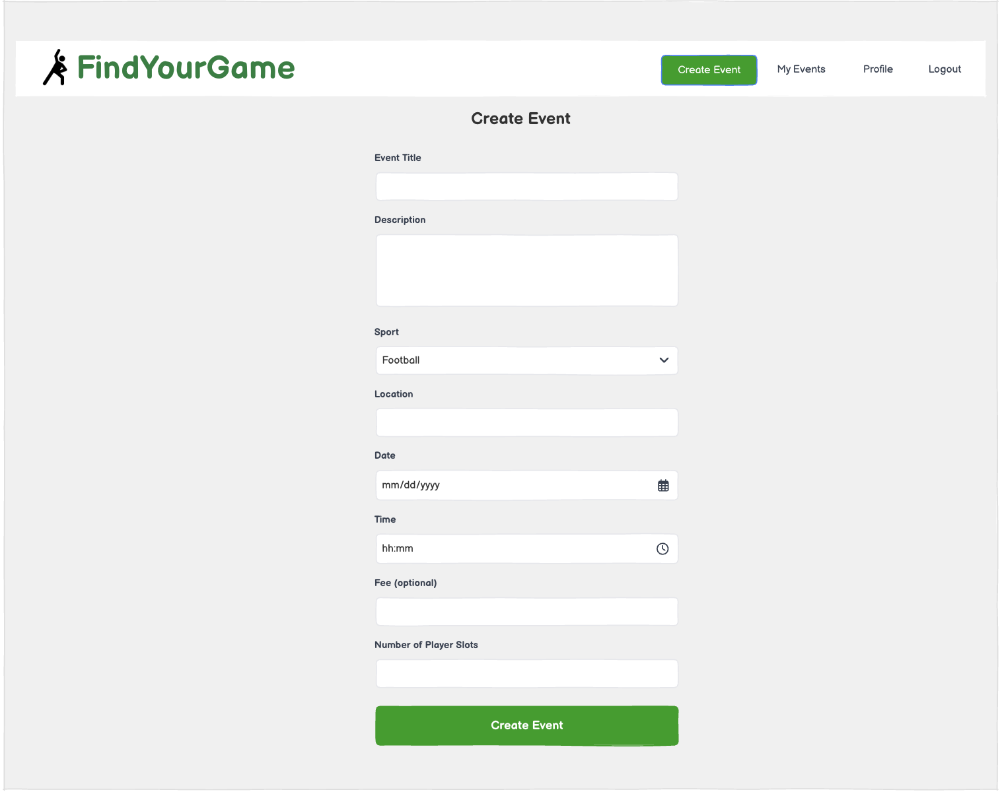
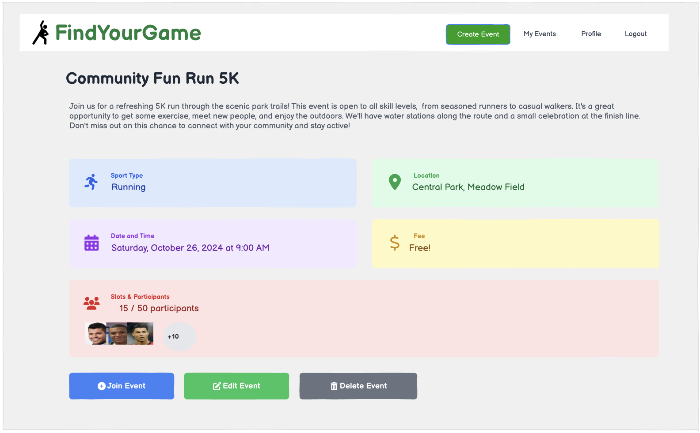
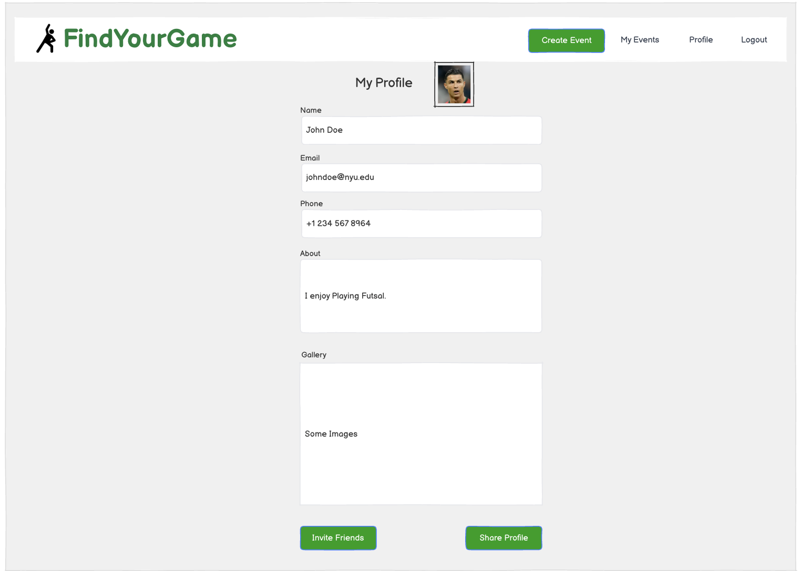

# FindYourGame

## Overview

In today’s fast-paced urban life, many people are so busy with work that they often forget to stay active or find time to play. Even when they want to, they rarely know where to start or how to find others to join.

FindYourGame is a web app designed to make it easy for people to discover and join sports events happening around their city. Users can create an account, log in, and either register new games or join existing ones based on their interests and schedules. The platform provides clear information about event times, locations, and availability. Some events may include small fees to cover field reservations or facility costs.

With FindYourGame, staying active and social has never been simpler—just find your game and play.


## Data Model

The application FindYourGame will store information about Users, Sports Events and Sports.

Users can create and join multiple sports events (via references).

Each event is linked to one sport, one location, and one user who created it and has ids of participating users.

Sports define the different types of games available in the app.


An Example User:

```javascript
{
  username: "nelsonplayer",
  email: "nelson@example.com",
  hash:                             // a password hash,
  createdEvents: ["e101", "e205"],  // references to Events the user created
  joinedEvents: ["e108", "e222"],   // references to Events the user joined
  createdAt:                      
}
```

An Example Sports Event:

```javascript
{
  title: "Saturday Morning Football",
  desciption:"Please bring a pair of Shoes and two Tshirts black and red"  
  sport: "Football",                     // reference to a Sport document
  location: "Central Park",              // Embeded Document with more details like (Address / GPS data for Map)
  date: "2025-10-25",
  time: "10:00 AM",
  fee: 5.00,
  slots: 12,
  owner: "u001",                          // reference to User who created the event
  participants: ["u002", "u005", "u009"], // user IDs of participants
  createdAt:                              // timestamp
}
```

An Example Sport:

```javascript
{
  name: "Football",
  type: "Team",
  equipment: ["ball", "Jerseys"]
}
```


## [Link to Commented First Draft Schema](db.mjs) 


## Wireframes

/ – landing page for introducing the app to new users



/signup – page for creating a new user account



/login – page for logging in existing users



/events – page for showing all available sports events



/events/create – page for creating a new sports event



/events/:id – page for showing a specific event’s details



/profile – page for showing the user’s profile and account information




## Site map

(__TODO__: draw out a site map that shows how pages are related to each other)

Here's a [complex example from wikipedia](https://upload.wikimedia.org/wikipedia/commons/2/20/Sitemap_google.jpg), but you can create one without the screenshots, drop shadows, etc. ... just names of pages and where they flow to.

## User Stories or Use Cases

1. As a non-registered user, I can browse all available sports events so that I can see what games are happening.
2. As a non-registered user, I can view details of any event (location, date/time, sport type, participants) so that I know more about it.
3. As a non-registered user, I must register or log in only if I want to join or reserve a spot in an event.
4. As a non-registered user, I can sign up for a new account so that I can participate in events.
5. As a user, I can log in to the app so that I can access my events and profile.
6. As a user, I can join or leave an event so that I can participate in games I’m interested in.
7. As a user, I can create a new sports event so that I can organize games for others to join.
8. As a user, I can view the events I have created or joined in a single place (/myevents) so that I can manage my schedule.
9. As a user, I can edit or delete events I own so that I can manage or cancel events I organized.
10. As a user, I can view and edit my profile so that my account information and preferences are up to date.

## Research Topics
### User Authentication (5 points)
- Implement dual authentication:  
  - **Local strategy**: users register/login with email/username and password.  
  - **OAuth (Open Authorization)**: users can optionally log in with Google or Facebook.  
- Ensure secure password storage (hashed), session management, and encrypted transfers.  
- Some reference sites:  
   
   
   

### Client-Side Input Validation (2 points)
- Validate registration, login, and event creation forms.  
- Provide real-time feedback for invalid input (e.g., required fields, numeric limits, email format). 

### Server-Side Validation (2 points)
- Complement client-side validation to securely reject invalid or malicious data.  
- Ensure events, dates, and fees meet business rules.  

### User Preferences with Cookies / localStorage (2 points)
- Persist preferences such as favorite sports, notifications, or UI settings.  
- Auto-filter events based on stored preferences for a personalized experience. 
- Require email Verification or phone number OTP verifications  

### Event Payments (Stripe Integration) (1 point)
- Integrate **Stripe** to handle payments for events that require fees.  
- Users can pay **securely with credit/debit cards** directly on the event page.  
- Payment status is linked to the user's account and updates the **event participant list**. 

### Map Integration & Location Tracking (1 point)
- Detect user location via IP-based geolocation (e.g., **ipapi** or **ipstack**).  
- Display events on an interactive map using either:  
  - **Google Maps JavaScript API** – markers, directions, info windows.  
  - **Leaflet.js** – lightweight, open-source mapping.  
  - **Mapbox** – custom styling and clustering.  
- Users can see nearby events, click markers for details, and get directions.  

### Analytics / Activity Tracking (1 point)
- Track user interactions and popular events using IP-based analytics or **Google Analytics**.  
- Report interactions to Event Creators


## [Link to Initial Main Project File](app.mjs) 


## Annotations / References Used

1. [passport.js authentication docs](http://passportjs.org/docs)
2. [Some useful public APIs](https://github.com/public-apis/public-apis)
3. [Stripe Payment](https://docs.stripe.com/)
